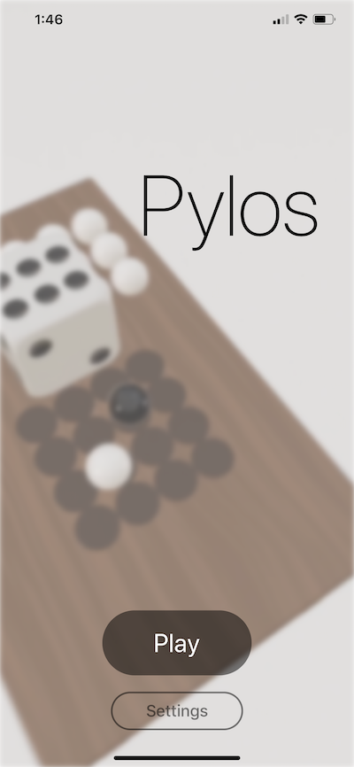

# AR Pylos game

> AR Pylos is a 2 players multiplayer AR game. The rules of original game https://en.wikipedia.org/wiki/Pylos_(board_game).

### Features
  
  - ARKit 3
  - SwiftUI 
  - RxSwift for business logic 
  - connection  is handled via bluetooth
  - game server is based on state machine pattern

### Onboarding:
When you lauch the game first time, onboarding screen with rules is appeared. It can be optionally launched in settings later.

### Home:
Gameplay playback is playing on the background. 

### Settings:
You can change your name shown to other players, ball colors and turn on onboarding screen with rules.

> Also supports dark theme

License
----

MIT
